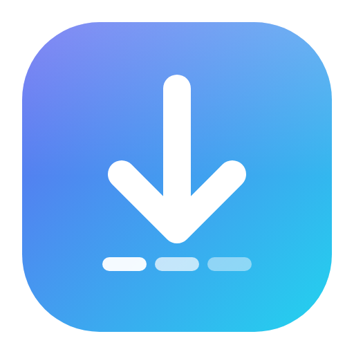
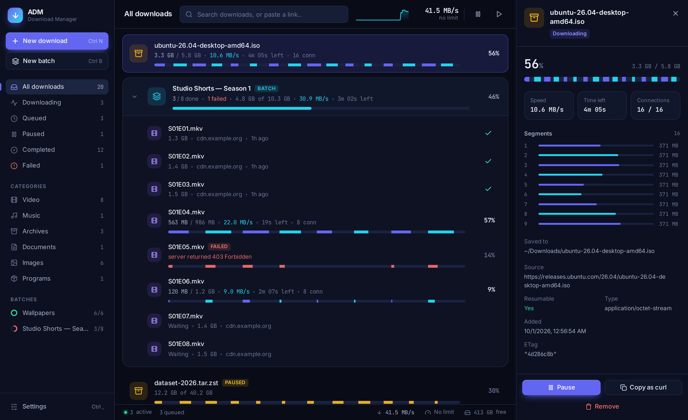
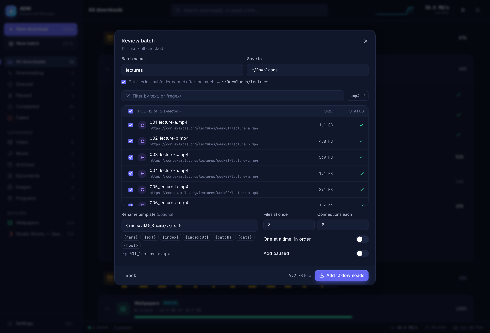
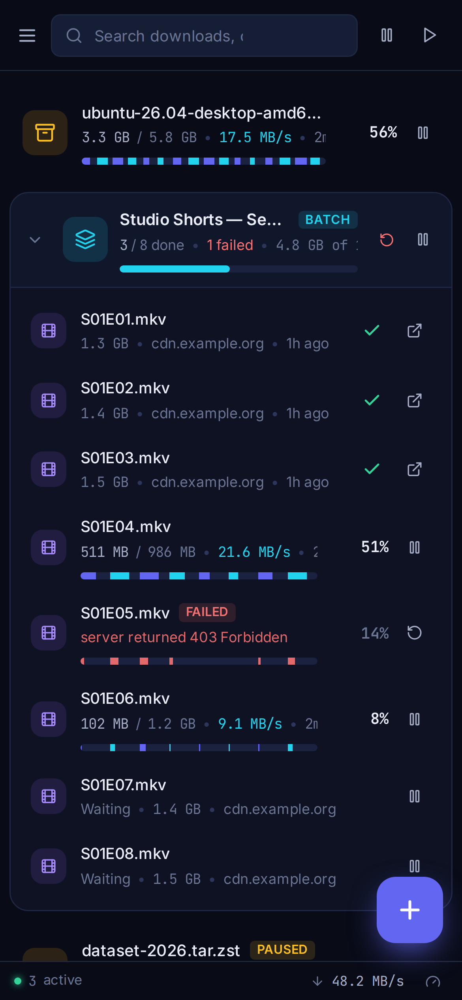
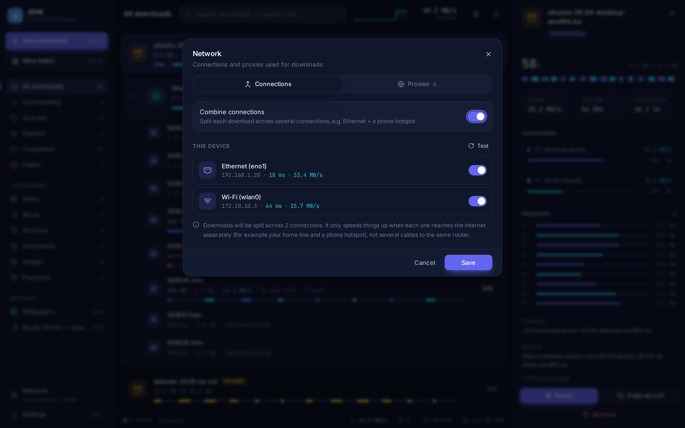
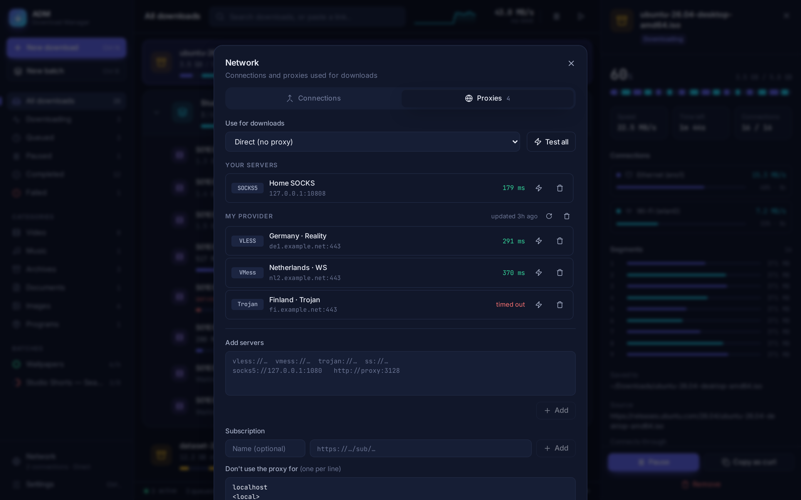
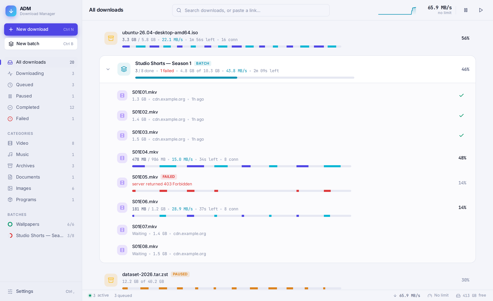
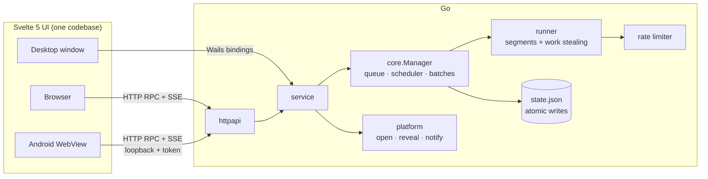

<div align="center">



# ADM: Advance Download Manager

**A fast, modern download manager for Linux, Windows, macOS, Android, and your home server.**<br/>
One Go engine, one beautiful UI, everywhere.

[](https://github.com/StrStark/advance-download-manager/actions/workflows/build.yml)
[](LICENSE)
[](go.mod)
[](frontend/package.json)


[Features](#-features) · [Get started](#-get-started) · [How it works](#-how-it-works) · [Build from source](#-build-from-source) · [Roadmap](#-roadmap)

<br/>



</div>

<br/>

## Why ADM?

Linux has great download *tools* (`aria2`, `wget`, `curl`) but no download *manager* that is both
powerful and pleasant to use. ADM combines an engine that fills your connection with a clean UI that
shows what every connection is doing. It also runs the same way on your desktop, your phone and your
NAS.

- ⚡ **Fast:** up to 32 connections per file, with work-stealing so no connection sits idle at the end
- 🛡️ **Resilient:** pause, crash, reboot or lose Wi-Fi and ADM picks up where it stopped
- 📦 **Batch-native:** paste a wall of text, a URL pattern or a file of links; review, rename and go
- 🔀 **Combine connections:** Ethernet + a phone hotspot, or Wi-Fi + mobile data, working together on one download
- 🛰️ **Proxies built in:** HTTP, SOCKS5 and V2Ray/Xray (VLESS, VMess, Trojan, Shadowsocks, REALITY) with subscriptions
- ✨ **Actually nice to use:** live segment map, speed graph, dark and light themes, keyboard-first
- 🌍 **Everywhere:** native desktop apps, an Android app, and a Docker image with a web UI
- 🧩 **Browser capture:** an extension hands browser downloads to ADM; ADM starts at login and updates itself

<br/>

## ✨ Features

<table>
<tr>
<td width="50%" valign="top">

### 🚀 Download engine
- **Segmented downloads**, up to 32 connections per file
- **Dynamic work stealing**: when a connection finishes, it splits the largest remaining segment, so the last few percent never crawl
- **Resume everywhere**: progress is saved every second and survives crashes and restarts
- **Safe resume**: ETag, size and range checks restart cleanly if the file changed
- **Smart retries**: exponential backoff with jitter; respects `Retry-After`
- **Honest-server fallback**: servers that claim range support but don't get a single-connection download automatically
- **Live speed limit** you can change without restarting downloads
- Custom headers, cookies, referer and user agent

</td>
<td width="50%" valign="top">

### 📦 Batch downloads
- **Paste anything**: links are pulled out of any text and duplicates removed
- **URL patterns**: `img[001-120].jpg`, `[a-z]`, `[0-100:5]`, several ranges at once
- **Import** `.txt`, `.csv` (url, filename, folder) or `.json`
- **Probe before you start**: size, name and resumability for every link, in parallel
- **Filter** by extension chips or `/regex/`
- **Rename templates**: `{index:03}_{name}.{ext}`, `{batch}`, `{date}`, `{host}`
- **Parallel or one-at-a-time**, per-batch limits, **retry failed only**

</td>
</tr>
<tr>
<td width="50%" valign="top">

### 🎨 Interface
- Per-connection **segment bars** and a live **speed sparkline**
- Details drawer with segment map, headers, **Copy as curl**
- **Paste anywhere** (`Ctrl V`) or **drag and drop** links onto the window
- Keyboard-driven: `Ctrl K` search, `Space` pause, `Delete`, arrow-key navigation
- Dark and light themes that follow the system
- Categories, batches and live counters in the sidebar
- Responsive layout down to phone size

</td>
<td width="50%" valign="top">

### 🧩 Integration
- **Browser extension** (Chrome, Edge, Brave, Vivaldi, Firefox): catches downloads and hands them to ADM with your session cookies; *Download with ADM* on any link
- **Start at login** (asked on first run) and **self-updating** from GitHub Releases
- **Linux**: app launcher entry, notifications, `adm <url>` hands links to the running app
- **Android**: foreground service, **Share → ADM** from any app, saves to `Download/ADM`
- **Server**: HTTP API + server-sent events, Basic auth, downloads confined to one folder
- **Clipboard watching** (opt-in) offers to download copied links
- Opens and reveals files with each platform's native tools

</td>
</tr>
<tr>
<td width="50%" valign="top">

### 🔀 Combine connections
- Split one download across **several network connections at once**: Ethernet + a phone hotspot, two ISPs, or Wi-Fi + mobile data on Android
- Each connection is pinned at the socket level (`SO_BINDTODEVICE` on Linux, `IP_UNICAST_IF` on Windows, `IP_BOUND_IF` on macOS, network handles on Android)
- Work stealing sends more of the file down the faster link automatically
- A link that can't reach the server, or a CDN that locks links to one IP, is dropped for that file; the rest carry on
- Live per-connection speed, and segment bars colored by connection

</td>
<td width="50%" valign="top">

### 🛰️ Proxies & V2Ray
- **HTTP, HTTPS, SOCKS5** proxies, plus a built-in **Xray-core** for **VLESS, VMess, Trojan, Shadowsocks (incl. 2022)** over TCP, WebSocket, gRPC, HTTPUpgrade and XHTTP, with TLS and **REALITY**
- Paste share links (`vless://`, `vmess://`, `trojan://`, `ss://`) or add a **subscription URL**
- **Test** any server: latency and exit IP
- Pick the proxy **per download or per batch**, with a global default and bypass rules (`<local>`, domains, CIDRs)
- Works together with multi-link: each connection reaches the proxy through its own interface

</td>
</tr>
</table>

<div align="center">
<table>
<tr>
<td></td>
<td width="24%"></td>
</tr>
<tr>
<td align="center"><sub>Batch review: 12 URLs from one pattern, numbered by a rename template</sub></td>
<td align="center"><sub>Android / phone layout</sub></td>
</tr>
<tr>
<td colspan="2">


</td>
</tr>
<tr>
<td colspan="2" align="center"><sub>Network panel: combine Ethernet + a phone hotspot, and V2Ray servers from a subscription</sub></td>
</tr>
<tr>
<td colspan="2"></td>
</tr>
<tr>
<td colspan="2" align="center"><sub>Light theme</sub></td>
</tr>
</table>
</div>

<br/>

## 🏁 Get started

**[⬇ Download the latest release](https://github.com/StrStark/advance-download-manager/releases/latest)**

| Platform | Download |
| --- | --- |
| 🪟 **Windows** 10/11 | `…_windows_amd64_setup.exe` installer |
| 🐧 **Debian / Ubuntu** and derivatives | `…_linux_amd64.deb`: `sudo apt install ./adm_*_linux_amd64.deb` |
| 🐧 Other Linux | `…_linux_amd64` portable binary |
| 🍎 **macOS** (Apple Silicon + Intel) | `…_macos_universal.dmg` |
| 🤖 **Android** 8.0+ | `…_android_arm64-v8a.apk` (most phones) |
| 🐳 **Docker** | `docker pull ghcr.io/strstark/advance-download-manager` |
| 🧩 **Browser extension** | `adm-browser-extension_…_chrome.zip` / `…_firefox.zip` |

After that, ADM **updates itself**: it checks GitHub daily and installs new versions from
**Settings → About & updates**. On the first run it asks whether to **start at login**, and with the
**browser extension** your downloads open straight in ADM (with your login cookies).

> First launch: Windows SmartScreen and macOS Gatekeeper warn about apps that aren't code-signed by a paid
> certificate yet. Use *More info → Run anyway* (Windows) or *right-click → Open* (macOS).

### 🐳 Docker (headless server)

Run ADM on a NAS, home server or VPS and control it from any browser, including your phone:

```bash
git clone https://github.com/StrStark/advance-download-manager.git
cd advance-download-manager
ADM_PASSWORD=change-me docker compose up -d
```

Open **http://localhost:8080** and log in as `admin`. Files land in `./downloads`.

<details>
<summary><b>Plain <code>docker run</code> and configuration</b></summary>

```bash
docker build -t adm .
docker run -d --name adm --restart unless-stopped -p 8080:8080 \
  -e ADM_PASSWORD=change-me \
  -v adm-data:/data -v ~/Downloads:/downloads adm
```

| Variable | Default | Purpose |
| --- | --- | --- |
| `ADM_PASSWORD` | *(none)* | Enables HTTP Basic auth. **Always set it when the port is reachable by others.** |
| `ADM_USER` | `admin` | Basic auth user |
| `ADM_LISTEN` | `:8080` | Listen address |
| `ADM_DATA_DIR` | `/data` | History and settings |
| `ADM_DOWNLOAD_ROOT` | `/downloads` | Every download folder must be inside it; relative paths resolve under it |

To **combine several network connections** from a container, give it the host's network
(`network_mode: host` in compose, or `--network host`), so it can see the real interfaces.

The image is small (distroless, static Go binary), runs as non-root, has a healthcheck, and
builds for `amd64` and `arm64` (Raspberry Pi, Synology and similar). In the browser UI, finished files
can be saved to the viewing device and link lists are imported by upload.

</details>

<br/>

## 🧠 How it works



- **One engine.** `internal/core` is pure Go with no UI code. Each download is a *runner* that splits
  the file into byte ranges and writes them with `WriteAt` into a pre-allocated `.part` file, so there
  is no merge step.
- **Work stealing.** When a connection finishes its range, it takes the largest remaining segment and
  splits it in half. Slow tails get parallelized automatically.
- **Routes.** Every download gets one or more *routes*: a network link plus an optional proxy
  (`internal/netpath`). Connections are spread across routes and bytes are counted per route. A route
  that fails is dropped for that file without failing it. Proxies run through Go's HTTP client (HTTP,
  SOCKS5) or an embedded Xray-core instance per route (`internal/proxy`).
- **Three shells, one UI.** The desktop app calls Go through Wails bindings. The server and the Android
  app expose the same methods over a small JSON RPC API plus server-sent events. The UI detects which
  backend it's talking to and adapts (native folder picker or text path, *Open* or *Save to this
  computer*, and so on).
- **Android** compiles the engine with `gomobile` and serves the UI on a private loopback port guarded
  by a per-launch token. Kotlin adds the foreground service, share target and notifications.

The full design is in the [**specification (PDF)**](docs/ADM-Specification.pdf).

<br/>

## 🛠 Build from source

**Requirements:** Go 1.27+, Node 20+, and for the desktop app [Wails v2](https://wails.io)
(`go install github.com/wailsapp/wails/v2/cmd/wails@latest`).

Xray-core is built in by default, which adds about 25 MB. Build with `-tags noxray` for a small binary
that supports only HTTP and SOCKS5 proxies.

### Linux

```bash
sudo apt install build-essential pkg-config libgtk-3-dev libwebkit2gtk-4.1-dev
make install        # build + add ADM to your app launcher (~/.local)
make dev            # hot-reload development
```

No root, or you don't want dev packages? `make docker-desktop` builds the Linux and Windows desktop
apps inside Docker and writes them to `dist/`.

### Windows / macOS

```bash
wails build -platform windows/amd64 -nsis     # on Windows (NSIS installer optional)
wails build -platform darwin/universal        # on macOS
```

`adm.exe` also cross-compiles from Linux (`wails build -platform windows/amd64`). It needs the
WebView2 runtime, which ships with Windows 10 and 11.

### Android

```bash
scripts/setup-android-tools.sh     # once: JDK 17, Android SDK + NDK, gomobile (~2 GB, into ~, no root)
scripts/build-android.sh           # → build/bin/adm-android-*.apk
adb install -r build/bin/adm-android-universal-debug.apk
```

Android 8.0+. APKs are split per CPU type, plus a universal APK. Release builds are signed from
`android/keystore.properties` when present.

### Releasing

Push a version tag and GitHub Actions builds every installer and publishes the release:

```bash
git tag v1.2.3 && git push origin v1.2.3
```

### Server only

```bash
make server        # pure Go, no GTK → build/bin/adm-server
```

### All `make` targets

| Target | Does |
| --- | --- |
| `make dev` | Desktop app with hot reload |
| `make build` / `make install` | Desktop app / plus launcher entry |
| `make server` | Headless server binary |
| `make test` | Go tests with the race detector |
| `make docker` / `make docker-desktop` | Server image / desktop builds in Docker |

**UI-only work:** `cd frontend && npm install && npm run dev` runs the UI in your browser against a
built-in simulated engine, with no Go needed.
**Phone UI on desktop:** `cp -r frontend/dist/. mobile/dist/ && go run ./cmd/android-sim`.

<br/>

## 🧪 Tests

```bash
go test -race ./internal/... ./mobile
```

The engine is tested against in-process HTTP servers that simulate range support, throttling,
`503`/`403` errors, servers that lie about ranges, unknown content lengths, and restarts
mid-download, with every result checked byte-for-byte.

<br/>

## ⌨️ Keyboard shortcuts

| Keys | Action |
| --- | --- |
| `Ctrl N` / `Ctrl B` | New download / new batch |
| `Ctrl K` | Search, or paste a link and press `Enter` |
| `Ctrl V` anywhere | Add the link(s) on the clipboard |
| `Space` | Pause / resume the selection |
| `Delete` | Remove the selection |
| `↑` `↓`, `Ctrl A`, `Shift`/`Ctrl` + click | Navigate and select |
| `Ctrl ,` | Settings |

On macOS, use `⌘` instead of `Ctrl`.

<br/>

## 📁 Project layout

```
main.go, app.go        desktop shell (Wails)
server.go              headless server (build tag: server)
internal/core/         engine: manager, runner, probe, limiter, store
internal/batch/        link extraction, URL patterns, list import, rename templates
internal/service/      API shared by every shell
internal/httpapi/      HTTP RPC + server-sent events (server and Android)
internal/platform/     per-OS: open/reveal files, notifications, disk space, data dir
internal/links/        network interfaces + per-OS socket pinning (multi-link)
internal/proxy/        HTTP/SOCKS5 + embedded Xray-core, share links, subscriptions
internal/netpath/      picks routes (links × proxy) for each download
internal/browser/      native-messaging host + browser registration
internal/update/       GitHub release check, download, per-OS install
internal/autostart/    start at login (XDG autostart, Run key, LaunchAgent)
browser-extension/     Manifest V3 extension (Chromium + Firefox)
mobile/                Android engine (gomobile bind)
android/               Kotlin app: WebView, foreground service, share target
frontend/              Svelte 5 + TypeScript + Tailwind CSS v4
build/, scripts/       icons, .desktop entry, Docker build env, install/build scripts
docs/                  specification and screenshots
```

Data lives in `~/.local/share/adm` (Linux), `~/Library/Application Support/ADM` (macOS),
`%AppData%\ADM` (Windows), or `/data` in Docker.

<br/>

## 🗺 Roadmap

- [x] Segmented engine with work stealing, resume, retries and speed limit
- [x] Batch downloads: paste, patterns, import, probe, filter, rename templates
- [x] Desktop apps (Linux / Windows / macOS), Android app, Docker server
- [x] Proxies: HTTP, SOCKS5, V2Ray/Xray (VLESS, VMess, Trojan, Shadowsocks, REALITY), subscriptions
- [x] Combine network connections (multi-link), including Wi-Fi + mobile data on Android
- [x] Browser extension (Chrome / Edge / Brave / Firefox) to capture downloads
- [x] Installers (setup.exe, .deb, .dmg, APK), start at login, in-app updates from GitHub Releases
- [ ] Publish the extension on the Chrome Web Store and addons.mozilla.org
- [ ] Queues with schedules (e.g. download 02:00–07:00) and per-host limits in the UI
- [ ] System tray and a `adm` command-line client
- [ ] BitTorrent / magnet links, FTP / SFTP
- [ ] HLS / DASH streams and an optional `yt-dlp` backend
- [ ] Page link grabber ("download all links on this page")
- [ ] Code-signed Windows/macOS builds and a Flathub package

Ideas and feedback are welcome in [issues](https://github.com/StrStark/advance-download-manager/issues).

<br/>

## 🤝 Contributing

1. Fork and create a branch.
2. `make test` must pass, and `cd frontend && npm run check` must report no errors.
3. Keep the engine (`internal/core`) free of UI code; platform-specific code goes in `internal/platform`.
4. Open a pull request describing *what* and *why*.

<br/>

## 📄 License

[MIT](LICENSE) © 2026 Mohamadreza ([@StrStark](https://github.com/StrStark))

<div align="center">
<sub>Built with Go, Wails, Svelte and Tailwind CSS. Icons by <a href="https://lucide.dev">Lucide</a>.</sub>
</div>
